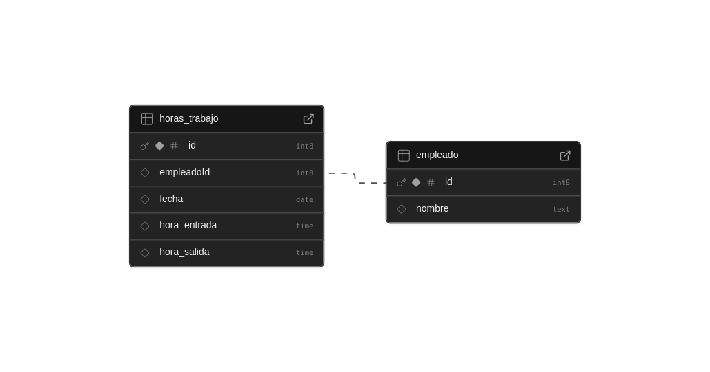

# SEGULA TECHNOLOGIES RESTFULL API

El código alojado en éste repositorio corresponde a la prueba técnica
para el proceso de trabajo en **Segula Technologies**.

Se trata de una **API REST** para la gestión de empleados así como sus horas
laborales.

El proyecto esta desplegado en la nube *Render* y la documentación puede ser
consultada siguiendo el link:

[segula.onrender.com/api](https://segula.onrender.com/api)

## DESARROLLO

Al inicio se había planteado usar *express.js* como tecnología base para
desarrollar la *API*; esta consideración esta sustentada por el hecho de
que el desarrollador **Roberto Miranda** cuenta con amplia experiencia en
este framework, sin embargo entre los requisitos para el puesto en
*Segula Technologies* se menciona tener conocimientos en *nestjs*, entonces
me tomé el tiempo para entender las ventajas que ofrece *nestjs* en
comparación con *expressjs* y entendí de inmediato que son muchas las ventajas,
pués *nestjs* ya tiene integradas las siguientes tecnologías:

- typescript
- typeorm
- swagger

Tecnologías requeridas en ésta prueba técnica. Por esta razón decidí aprender
*nestjs* y usarlo como tecnología base.

## ARQUITECTURA

La arquitectura de la prueba técnica quedá determinada por lo que es, una
**API REST** sobre el protocolo **HTTP** que por construcción es **stateless**

Los componentes de la *API* quedan determinados por el Framework elegido *nestjs*:


- Modules - encapsula los controllers y services en una sola unidad lógica
- Controllers - recibe las peticiones http
- Services - uso de typeorm para conectarse a la base de datos
- Guards - realiza validaciones a las peticiones de entrada

Se aplica el paradigma de programación *OOP* en todo el proyecto y para la
inyección de dependencias se usa la técnica *Inversion Of Control* pero
de esto se encarga el framework de tal manera que el desarrollador no necesita
escribir código para la *IoC*.

## BASE DE DATOS

Hay dos tipos de bases de datos a usar, las del tipo *SQL* y las que son *NoSQL*. Yo
he elegido *postgresql* que es de tipo *SQL*.

En la descripción del proyecto quedan claras dos entidades:

- Empleado
- Horas Trabajadas

Claramente para una instancia de *Empleado* le corresponden varias instancias de la
entidad *Horas Trabajadas*.

El enunciado anterior sugiere un modelo *Entidad - Relación* por lo que debemos
usar un manejador de tipo relacional *SQL*. Hemos elegido *postgres* la cual está
montada en la nube *supabase*.



La Tabla *Empleado* tiene dos campos:

- id: primary key
- nombre: el nombre del empleado

Siendo irrelevante agragar más campos.

La tabla *Horas_Trabajo* tiene varios campos:

- id: primary key
- empleadoId: foreign key hacia la propiedad id de la tabla *Empleado*
- fecha: la fecha de un día de trabajo
- hora_entrada: la hora en que el empleado se presento a trabajar
- hora_salida: la hora en que el empleado salio de trabajar

A la tabla *horas_trabjo* se le agrego la siguiente restricción:

```bash
alter table horas_trabajo
add constraint unique_horas_trabajo
unique ("empleadoId", "fecha")
```
para evitar que en la tabla se agreguen más de un registro de
un *empleadoId* con la misma *fecha*. Es decir se evitan registros
como en el siguiente ejemplo:

|id | empladoId | fecha | hora_entrada | hora_salida |
|-------|-------|-------|-------|-------|
| 7 | 9 | 2025-03-12 | 12:00:00 | 22:00:00 |
| 8 | 9 | 2025-03-12 | 10:30:00 | 20:30:00 |


en donde *empleadoId* y *fecha* tienene el mismo valor en ambos
registros.

A la base de datos también se le delega la eliminación de los
registros en la tabla *horas_trabajo* cuando se elimina un registro
de la tabla *empleado*: Esto se logra estableciendo la restricción
`ON DELETE CASCADE` a la llave foranea `empleadoId` en la tabla
`horas_trabajo`

Dado que *nestjs* ya trae integrado **Typeorm** entonces se hace uso de
este *ORM* para el manejo de las consultas a la base de datos desde
el código.

## TESTING

Se hace uso de la biblioteca *Jest* para las pruebas unitarias.
Se cuenta con un archivo para cada uno de los *controllers*
con los que cuenta la *API*

- `empleado.controller.spec`

- `horas_trabajo.controller.spec`

Para iniciar las prueba se debe ejecutar el siguiente comando:

`npm run test`

## PROJECT SETUP

```bash
$ npm install
```

## EJECURAR Y COMPILAR

```bash
# development
$ npm run start

# watch mode
$ npm run start:dev

# production mode
$ npm run start:prod
```

## DOCKER

Para dockerizar la *API REST* proporciono los archivos necesarios:

- Dockerfile

- docker-compose.yml

para crear la imagen docker de la prueba técnica primero hay que clonar el proyecto:

`git clone git@github.com:robermiranda/segula.git`

y después ejecutamos el comando docker:

`docker compose up`

## EJEMPLOS

Puedes realizar las siguientes peticiones GET desde el navegador:

- [/empleado](https://segula.onrender.com/empleado) - Obtiene la
lista de todos los empleados

```
[
  {
    "id": 1,
    "nombre": "Roberto Miranda"
  },
  {
    "id": 2,
    "nombre": "Gabriela Morales"
  }, ...
```

- [/empleado/1](https://segula.onrender.com/empleado/1) - Obtiene
el registro del empleado con *id = 1*


```
{
  "id": 1,
  "nombre": "Roberto Miranda"
}
```

- [/horas-trabajo](https://segula.onrender.com/horas-trabajo) - Obtiene
la lista de registros en la tabla horas_trabajo la cual guarda una relación
de las horas trabajadas por día para cada empleado

- [/horas-trabajo/empleado/1](https://segula.onrender.com/horas-trabajo/empleado/1) -
obtiene la lista de las horas trabajadas para el empleado con *id = 1*

```
[
  {
    "id": 1,
    "fecha": "2025-02-01T00:00:00.000Z",
    "horaEntrada": "08:00:00",
    "horaSalida": "17:00:00",
    "empleadoId": 1
  },
  {
    "id": 33,
    "fecha": "2025-02-04T00:00:00.000Z",
    "horaEntrada": "10:00:00",
    "horaSalida": "16:40:00",
    "empleadoId": 1
  },
  {
    "id": 37,
    "fecha": "2025-02-05T00:00:00.000Z",
    "horaEntrada": "09:00:00",
    "horaSalida": "16:55:00",
    "empleadoId": 1
  },
  {
    "id": 38,
    "fecha": "2025-02-06T00:00:00.000Z",
    "horaEntrada": "09:00:00",
    "horaSalida": "18:00:00",
    "empleadoId": 1
  }
]
```

- [/horas-trabajo/payroll/1/2025-02-01/2025-02-05/1000](https://segula.onrender.com/horas-trabajo/payroll/1/2025-02-01/2025-02-05/1000) - obtiene el *payroll* para el empleado
con `id = 1` en el intervalo de fechas `[2025-02-01 , 2025-02-05]` con una
tarifa horaria de `$1,000.00`

```
{
  "diasTrabajados": 3,
  "horasTrabajadas": 23.5833333333333,
  "horasNormales": 23.5833333333333,
  "horasExtra": 0,
  "tarifaHoraria": 1000,
  "payroll": 23583.33
}
```

Es necesario hacer notar que en el calculo del payroll
**NO estoy considerando la hora de comida del empleado**,
es decir, para el siguiente ejemplo:

```
{
    "id": 38,
    "fecha": "2025-02-06T00:00:00.000Z",
    "horaEntrada": "09:00:00",
    "horaSalida": "18:00:00",
    "empleadoId": 1
  }
```
en el calculo del payroll se consideran 9 horas laboradas en el día
2025-02-06 para el empleado con *id = 1*, por lo que NO se consideran
8 horas laboradas mas 1 hora de comida.

Para agregar un registro de empleado hacemos una petición `POST` usando
`curl` como en el siguiente ejemplo:

```
curl -d '{"nombre":"Ricardo Larios"}' -H "Content-Type: application/json" -X POST https://segula.onrender.com/empleado
```

Para más ejemplos puede consultar la api: [segula.onrender.com/api](https://segula.onrender.com/api)

## CONTACTO

- Author - [Roberto Miranda Morales](https://romix-dev.netlify.app/)
- mail - rob.mirandam@gmail.com
